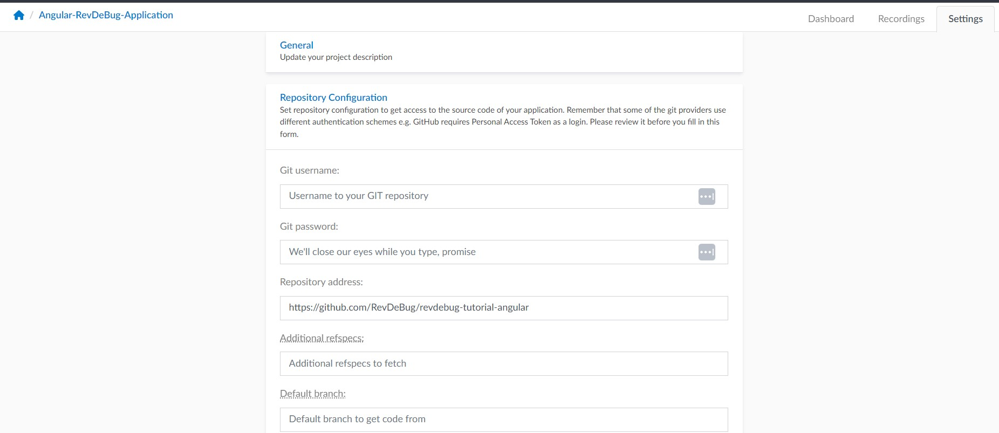
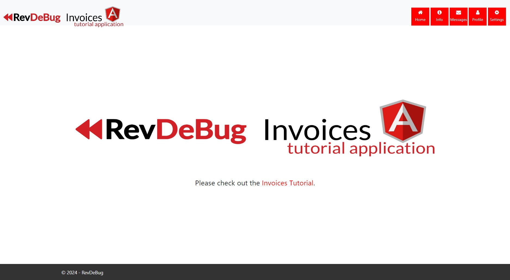
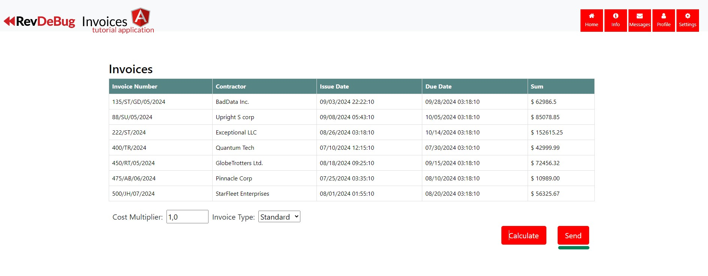
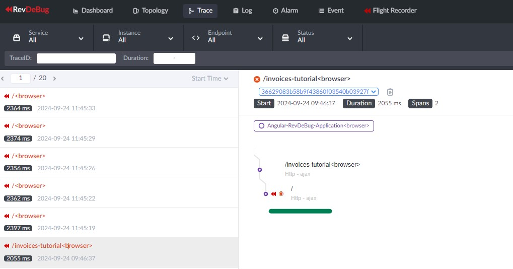
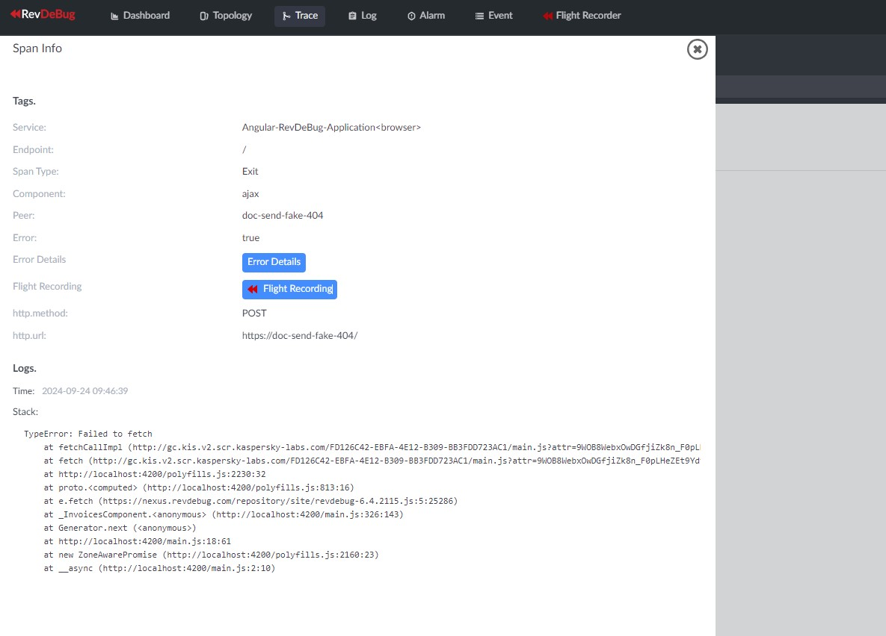
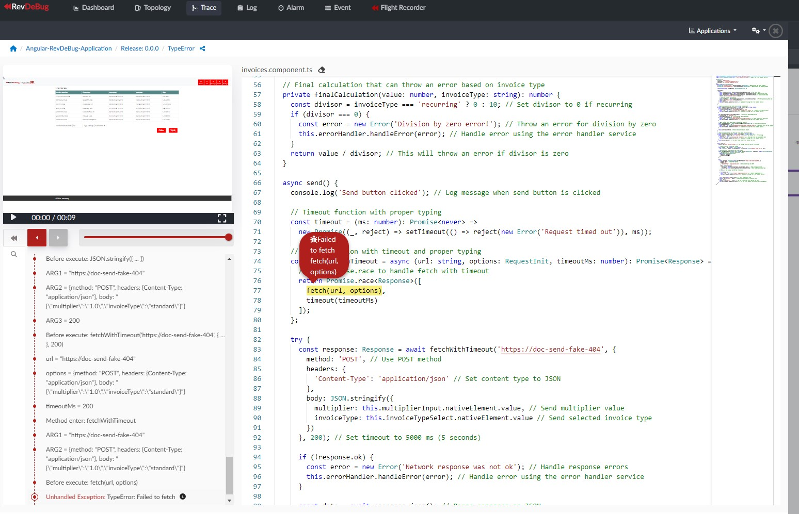
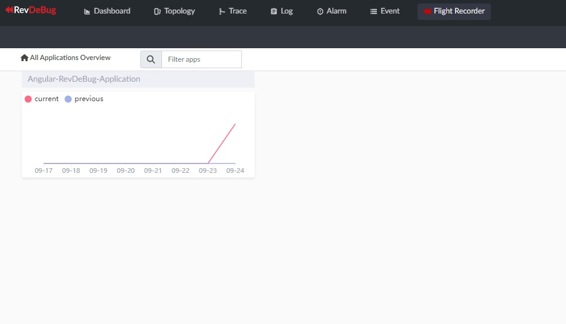
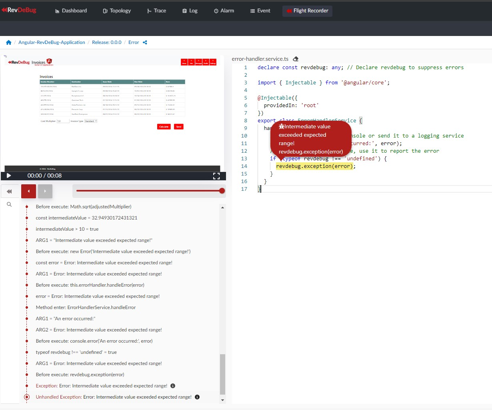
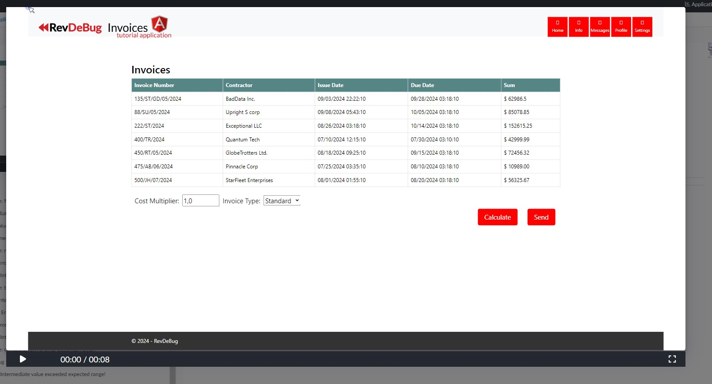

# Angular RevDeBug Demo Application

This project is a demo of how to integrate and use RevDeBug in an Angular application to monitor user actions, record application performance, and trace errors.

## Clone the project
Go to the directory where you want to clone the repository:
```bash
git clone https://github.com/RevDeBug/revdebug-tutorial-angular
```
## Overview
RevDeBug is a powerful tool that allows you to:

- Trace application execution: Monitor how your application behaves and capture  performance metrics.
- Record user interactions: Capture how users interact with your website, including screen recordings.
- Record and replay errors: Capture errors in real-time and use RevDeBug’s trace to identify root causes quickly.

The demo includes a sample Angular application configured with intentional errors, so you can observe how RevDeBug can help track down bugs efficiently.

## Setup Instructions
### Prerequisites
Ensure you have the following installed on your machine:

- Node.js (version 18 or higher)
- Angular CLI
- RevDeBug npm module (globally or locally installed)

### Installation Steps
1.  Set up the RevDeBug npm registry:

```bash
npm config set @revdebug:registry https://nexus.revdebug.com/repository/npm/
```
2. Install dependencies:
```bash
npm install
npm install @revdebug/revdebug
```

### RevDeBug Configuration
You need to set the RevDeBug server host in the configuration, which can be changed in the revdebug.json configuration file, as shown below:

```json
{
    "host": "revdebug.server",                   //    The server host where RevDeBug will connect.
    "secure": true,                              //    Whether to use a secure HTTPS connection.
    "port": 42734,                               //    The port to connect to the host.
    "apm": true,                                 //    Enables Application Performance Monitoring (APM) to track app performance.
    "screen": true,                              //    Enables screen recording of application usage.
    "screenTime": 10,                            //    Sets the maximum duration (in seconds) for screen recording.
    "solution": "Angular-RevDeBug-Application",  //    The name of the solution or project.
    "application":"Angular-RevDeBug-Application",//    The name of the specific application being monitored.
    "type": "module",                            //    Defines the project type, 'module' indicates it's part of a larger system.
    "mode": "onevent",                           //    Specifies that RevDeBug should record only on specific events.
    "sourceMap": true,                           //    Enables the use of source maps for easier debugging by mapping minified code to original.
    "path": "src",                               //    Sets the base path where the source files are located.
    "index": "src/index.html",                   //    Specifies the main HTML file to be modified for RevDeBug injection.
    "files": "**/*.{js,ts}",                     //    Defines the files to be instrumented for RevDeBug (all JS and TS files in 'src').
    "target": "web",                             //    The target environment for the project (web-based).
    "entrySpan": "multi",                        //    Specifies multiple entry spans to capture performance metrics.
    "useFMP": true,                              //    Enables capturing First Meaningful Paint (FMP) for performance analysis.
    "framework": "angular"                       //    Indicates that the project is built using the Angular framework.
}
```
This configuration connects the application to a RevDeBug server, enables screen recording for 10 seconds, and captures performance metrics (APM). All JavaScript and TypeScript files in the src directory are instrumented.

3. Instrument your application with RevDeBug:

Run the RevDeBug script to instrument the source files:
```bash
npx revd
```
4. Start the Angular application:
```bash
ng serve
```
Navigate to `http://localhost:4200/`. 

## Running with Docker
To run the Angular application using Docker, follow these steps:

For more information on how to configure RevDeBug, see the [RevDeBug Configuration](#revdebug-configuration) section.

Build the Docker image:
```bash
docker-compose build
```
Run the Docker container:
```bash
docker-compose up
```
Access the application: Open your browser and navigate to http://localhost:8080/.

## Connect code repository
Follow the “connect to repository” option and fill the “Repository address” to github repository location of https://github.com/RevDeBug/revdebug-tutorial-angular and press “Save”.


## Demonstrating Errors in the Application

The demo application includes pages with intentionally introduced bugs to show how RevDeBug captures errors and traces them.

### 1. Fetch Error Monitoring

RevDeBug allows you to monitor requests sent from the frontend and visualize them in the APM trace. This feature is particularly useful for tracking and diagnosing issues related to API calls or any requests made by the application.

#### Steps to Reproduce:

1. Open the application in your browser:  
   Navigate to [http://localhost:4200/](http://localhost:4200/).  
   
   
2. Click on **Invoices Tutorial** in the navigation bar.  
   

3. Click the **Send** button to trigger the request.  
   

4. Now, go to your **RevDeBug server** and navigate to `/apm/trace`. After a few seconds, the fetch request failure will appear in the trace.  
   
   

5. By clicking on the specific trace node for the failed request, you can inspect further details.  
   

6. From the trace node, you can access the **error recording** for this specific failure, where you can replay the user action and inspect the exact cause of the error.  
   

This trace visualization allows you to track the flow of requests, analyze failures, and pinpoint the root cause of the problem efficiently.

### 2. User Input Error Monitoring

In the RevDeBug server, you can inspect the recording to trace the steps taken by the user, allowing you to follow the exact sequence that led to the issue and identify the root cause effectively.

#### Steps to Reproduce:

1. While remaining on the **Invoices Tutorial** page, set the input to a value greater than 10 and change the select to either **Proforma** or **Recurring**.  
   

2. Click the **Calculate** button to trigger the calculation and send the request.

3. Now, navigate to your **RevDeBug server** and go to `/apm/monitor`. Click on **Applications**.  
   

4. On the **Applications** page, you will see a table of exceptions with every error that occurred in the application and was captured. Click on a selected error to view its recording.  
   

5. You can now review the stack trace for the occurrence of the error and watch the recording of user actions on the page that led to the error.  
     
   

## Benefits of Using RevDeBug

By using RevDeBug, you can:

- Save time: Quickly identify and resolve the root cause of issues by replaying exact user sessions.
- Improve user experience: Track application performance and optimize it based on real-world usage.
- Reduce costs: Spend less time debugging and more time building new features, leading to faster delivery and lower maintenance costs.

For detailed documentation, refer to <a href="https://revdebug.gitbook.io/revdebug/supported-langauges/javascript">RevDeBug Official Documentation</a>.
